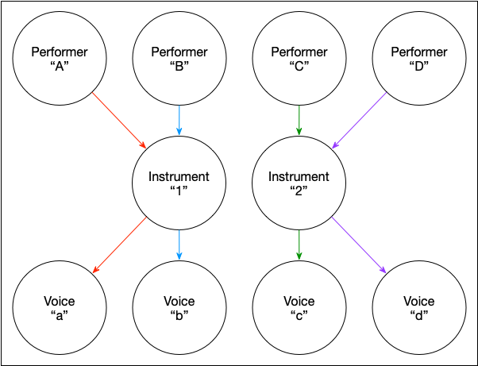

# MusicModel

The `MusicModel` module defines a database for storing musical information.

The `Model` object is an aggregate of information describing the performing forces (`Performer`, `Instrument`, and `Voice`), and the musical information which are actuated by them.

## PerformanceContext

The `PerformanceContext` of a `Model` is an aggregation of `Performer`, `Instrument`, and `Voice` structures. In a `PerformanceContext`, there are any number of performers and instruments. A performer can play one or more instruments, and a single instrument can be played by one or more performers. 

A `Performer`-`Instrument` pair can manifest in one or more voices.

### Examples

#### Solo

The most basic example of a `PerformanceContext` is one in which there is a single `Performer`, playing through a single `Instrument`, with only a single `Voice`.

For example, imagine a single flutist performing monophonic material.

#### Complex Solo

Often, music for a single instrument can be polyphonic, where multiple voices are performed concurrently by a performer. This can be modeled with a single `Performer` playing through a single `Instrument`, with multiple `Voice` values.

In the case of a percussion solo, for example, there is often more than one instrument played by a single `Performer`.

In this example, a single percussionist could be playing three different instruments (e.g., snare drum, bass drum, triangle). In this case, bass drum and triangle are polyphonic. That is, there may be concurrent figures on the same instrument which are notated with different rhythmic values.

Each `Performer`-`Instrument` pair has one or more voices, each being unique to it.

#### Ensemble

Very often, people play music together. A relatively straightforward example of this is a string quartet, in which each performer's material is monophonic.

#### Intertwined Ensemble

There are often cases in which multiple performers play on the same physical instrument. This happens commonly in percussion ensembles.

In this case, imagine four percussionists, playing on two different physical instruments. Each `Performer`-`Instrument` pair emits a single, unique voice.